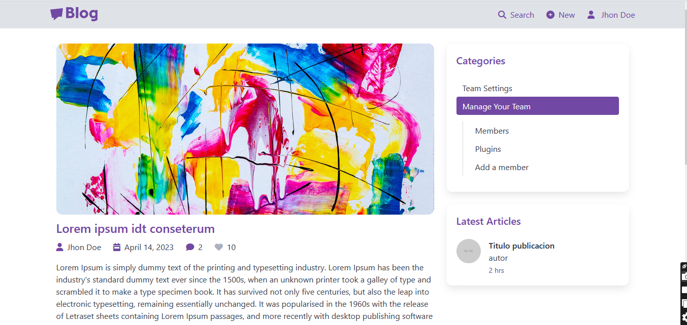

# Blog Platform

A blog platform that allows users to create, read, update, and delete posts. It supports user authentication, image uploads, and comment systems.

## Features

- User registration and login
- Create, edit, delete blog posts
- Comment system
- Likes system
- Image upload for posts
- Search and filter posts
- Responsive design
- Authentication and authorization

## Tech Stack

**Frontend:**
- React
- Bulma

**Backend:**
- C# .NET 6
- Entity Framework

**Database:**
- SQL Server

## Project Structure